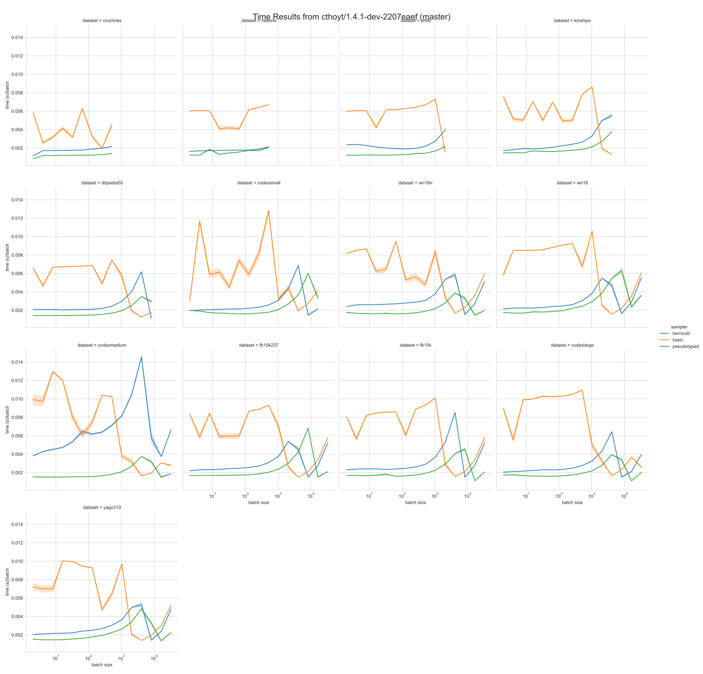

# negative-sampler-benchmark

🪑 Benchmark PyKEEN's negative samplers' false negative rates

## Speed Performance

Run the speed performance benchmarks with:

```shell
$ python main.py times
```



## False Negative Rate

Run false negative rate benchmarks with:

```shell
$ python main.py fnr
```


