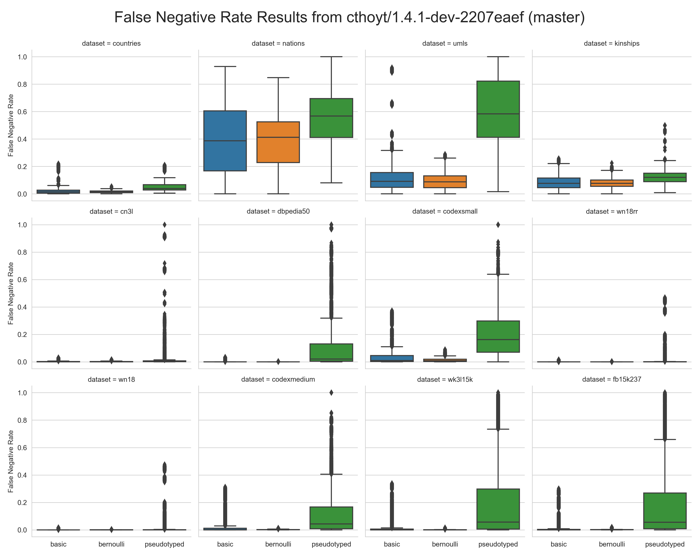

# negative-sampler-benchmark

🪑 Benchmark PyKEEN's negative samplers' false negative rates. Run with:

```shell
$ python -m pip install -r requirements.txt
$ python main.py
```

It will keep track of your username via `getpass` and the git hash if you
have a development version of PyKEEN installed.

## Speed Performance


## False Negative Rate

The plot demonstrates that the pseudo-typed negative sampler should be used in combination with filtering. The Nations
dataset has a unique pattern because it was constructed under the closed world assumption (unlike most knowledge graphs)
and therefore most negative samples are false negatives.


