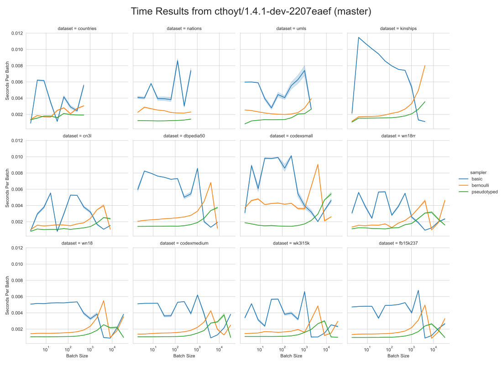
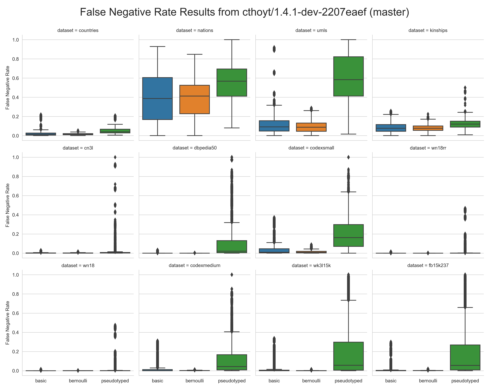

# Results on PyKEEN v1.4.1-dev ([2207eaef](https://github.com/pykeen/pykeen/commit/2207eaef); master)

Run again with:

```shell
$ git clone https://github.com/pykeen/pykeen.git
$ cd pykeen
$ git checkout 2207eaef
$ pip install -e .
$ cd ..
$ git clone https://github.com/pykeen/negative-sampler-benchmark.git
$ cd negative-sampler-benchmark
$ python main.py
```

## Speed Performance



## False Negative Rate

        

